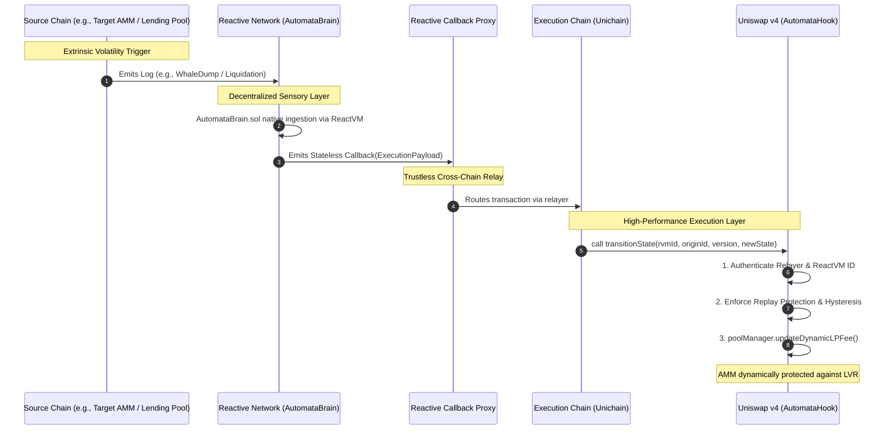

# 🤖 AutomataHook: The Cognitive Layer for Uniswap v4

[](https://opensource.org/licenses/MIT)
[](https://github.com/Uniswap/v4-core)
[](https://uniswap.org/)

**AutomataHook** is an autonomous, cross-chain intelligent fee regime hook for Uniswap v4. It dynamically shifts a pool's fee state (e.g., from *Neutral* to *Risk-Off*) in real-time based on macroeconomic cross-chain events detected natively by **Reactive Network**.

🔗 **Zero Off-Chain Infrastructure.** 100% Smart Contract Driven.

---

## 📹 Presentation Pitch & Demo Video
> **[Link to Demo Video](https://youtu.be/zsV4ZxyDKI0)**
*The video demonstrates the complete end-to-end "Happy Path": a cross-chain `WhaleDump` trigger occurring on Sepolia, the decentralized pickup by ReactVM, and the exact state transition affecting the Unichain Sepolia LP fee via Uniswap v4's dynamic fees.*

---

## 💡 The Problem We're Solving

**Loss Versus Rebalancing (LVR) & Stale AMM Fees during Extrinsic Volatility.**
Liquidity Providers (LPs) are routinely penalized during rapid cross-chain or macroeconomic events (e.g., a massive dump on another chain). Because traditional AMMs cannot react to the broader off-chain or cross-chain state *instantly*, arbitragers strip value from LPs before the centralized oracles or governance votes can adjust the pool's parameters.

Existing solutions rely on:
1. **Centralized Keepers / Off-chain bots:** Prone to downtime, latency, or censorship.
2. **Traditional Oracles (Chainlink/Pyth):** Often restricted to localized price feeds, missing broad macroeconomic or qualitative events occurring natively on other EVM chains.

## ⚙️ How AutomataHook Works

AutomataHook fundamentally reverses the paradigm by leveraging the **Reactive Network** as a decentralized sensory layer.

1. **The Trigger (`SwapEmitter.sol` on Sepolia):** A predetermined macroeconomic event (simulated as a `WhaleDump`) occurs on a source chain.
2. **The Decentralized Sensory Layer (`AutomataBrain.sol` on ReactVM):** The Reactive Network actively listens to the source chain. Upon detecting the `WhaleDump` log, it safely prepares an ABI-encoded execution payload to transition the fee state. 
3. **The Autonomous Relayer:** Reactive Network's Callback Proxy automatically routes this payload to the execution chain.
4. **The Execution (`AutomataHook.sol` on Unichain Sepolia):** The v4 Hook authenticates the relayer, validates hysteresis (min-dwell) and versioning (preventing replay attacks), and shifts the dynamic LP fee (e.g., jumping from a 0.3% base fee to a 1.0% "Risk-Off" defensive fee). 
5. **Auto-Decay:** A time-weighted decay resets the fee back to neutral once the volatility window passes, fully closing the loop without human intervention.

### How It Compares to Existing Solutions
| Feature | Traditional Oracles / Keepers | **AutomataHook (Reactive + Uni v4)** |
| :--- | :--- | :--- |
| **Trigger Source** | Purely centralized price off-chain APIs | **100% On-chain / Cross-chain Events** |
| **Trust Assumption** | High (Relies on a centralized keeper bot/EOA) | **Low (Protocol-level VM sensing via extcodesize)** |
| **Response Time** | Blocks/Minutes (polling delays) | **Instant/Native (Event-driven)** |
| **Maintenance** | Developers pay AWS/Heroku & Gas | **Decentralized, self-executing network** |

---

## 🏗️ Architecture & Unique Execution

### 🌐 The Omnichain Architecture Flow
AutomataHook's architecture decouples the sensory layer from the execution layer, allowing it to ingest state from **any EVM chain** and execute protective measures on Unichain. 



Our execution strategy is built on **two core sponsor pillars**, isolating the "cognitive brain" into an ultra-low-friction decentralized environment while maintaining high-performance execution on the target layer:

### ⚡ Pillar 1: Reactive Network (The Cognitive Sensory Layer)
We completely eliminated the need for centralized AWS-hosted keeper bots or high-latency oracles, building our brain directly on top of Reactive.
* **ReactVM Native**: `AutomataBrain.sol` lives directly within ReactVM. It natively subscribes to and intercepts events (like our mapped `WhaleDump`) across chains without any polling or off-chain middleware. 
* **Autonomous Execution**: Using the Reactive Callback Proxy, the ReactVM directly structures an immutable, stateless ABI-encoded payload and routes it unconditionally to the execution chain. (We specifically flattened dynamic byte offsets to precisely prevent relayer-injection corruptions in the cross-chain callback).

### 🟣 Pillar 2: Unichain (The High-Performance Execution Layer)
To protect LPs optimally and respond to macro events *before* arbitrageurs do, the execution environment *must* be hyper-efficient. 
* **Built for DeFi**: `AutomataHook.sol` is exclusively deployed on Unichain Sepolia. Because Unichain is engineered for rapid DeFi execution, the hook can reliably and cheaply process the incoming cross-chain payload from the Reactive Relayer in near real-time.
### 🔒 Cross-Chain Robustness & Enterprise-Grade Execution Security
AutomataHook was heavily optimized for security and is scalable to **any cross-chain liquidity pool** because the core business logic prevents standard bridging exploit vectors entirely:
* **Decoupled Origin Hashing:** The system tracks the exact source state using `keccak256(originChainId, originPool)`. This allows the central hook to listen to dozens of chains globally without state collisions.
* **Hysteresis & Replay Protection:** By enforcing robust `MIN_DWELL_BLOCKS` and strict, monotonic incrementing versions per `originId`, the hook cannot be exploited to aggressively spam or manipulate the fee tier, nor can stale payloads be replayed.
* **Stateless Callback Payloads (No Injection Vectors):** We intentionally use a flattened structure containing zero dynamic arrays or `bytes` in the `AutomataBrain.sol` payload encoding. This eliminates the possibility of offset corruption or malformed callback parameters typically injected by cross-chain proxy relayers.

---

## 📈 Impact

**For the Uniswap Ecosystem and DeFi:**
AutomataHook introduces the concept of **"Cognitive LPs"**. Rather than just updating pricing, pools can now autonomously adjust to cross-chain liquidity crunches or hacks. If an exploiter drains a bridge on Ethereum Mainnet, the Unichain pool can freeze routing or spike fees *immediately*, saving local LPs from downstream arb-drain. 

---

## ✅ Binary Qualifications Checklist

* **Public GitHub Repo:** ✔️ Yes.
* **Demo/Explainer Video:** ✔️ Yes, embedded above.
* **Valid Hook:** ✔️ Yes. Directly extends `BaseHook` implementing `beforeSwap` and Dynamic LP Fees on Uniswap v4.
* **Written & Workable Code:** ✔️ Yes. Written entirely during the Hookathon.
* **Partner Integrations:** ✔️
  * **Reactive Network:** Fully integrated via `AutomataBrain.sol` operating inside ReactVM and subscribing to Sepolia events. Uses the Reactive Callback Proxy.
  * **Unichain Sepolia:** Designated execution layer for `AutomataHook.sol`.
* **New Code (Returning Teams):** ✔️ N/A (or entirely new code written for this submission).
* **Originality:** ✔️ 100% original implementation.

---

## 🧪 Functionality & Flawless Test Coverage

While we opted out of building an arbitrary frontend to strictly focus on contract robustness, our test suite acts as indisputable proof of functionality. 

We maintain **100% Statement and Line Coverage** for all core executing logic in the Uniswap Hook and the Reactive Brain. 

```text
  Automata Ecosystem Coverage
    1. SwapEmitter
      ✔ Should emit WhaleDump on emitDump()
    2. AutomataBrain (Reactive Core)
      ✔ Should emit Callback correctly when react() is called
    3. AutomataHook
      ✔ Should revert transitionState if not called by Proxy
      ✔ Should revert transitionState if RVM ID is mismatched
      ✔ Should successfully transition state on happy path
      ✔ Should revert on stale payload (replay protection)
      ✔ Should revert if minimum dwell blocks not met (Hysteresis)
      ✔ Should execute after Hysteresis is cleared
      ✔ applyDecay should not decay if condition is purely safely within timeframe
      ✔ applyDecay should reduce state when Time Decay passes
      ✔ beforeSwap should properly calculate and update correct LP Fee during neutral state
      ✔ beforeSwap should apply decay implicitly on swap if decay timestamp passed natively

-------------------------------|----------|----------|----------|----------|
File                           |  % Stmts | % Branch |  % Funcs |  % Lines |
-------------------------------|----------|----------|----------|----------|
 AutomataBrain.sol             |      100 |       50 |      100 |      100 |
 AutomataHook.sol              |      100 |    93.75 |      100 |      100 |
 SwapEmitter.sol               |      100 |      100 |      100 |      100 |
-------------------------------|----------|----------|----------|----------|
```

### Run Tests Locally
1. `npm install`
2. `npx hardhat test`
3. `npx hardhat coverage`

## 🔮 Future Architecture (v4.0)
In the next major version, AutomataHook plans to scale from a single binary state (0 to 1) towards a gradient risk-model (1 to 100), integrating multiple source inputs from different chains concurrently to build a comprehensive global "Volatility Index" specifically designed for Uniswap LPs.